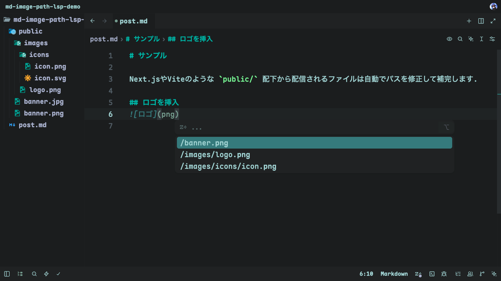
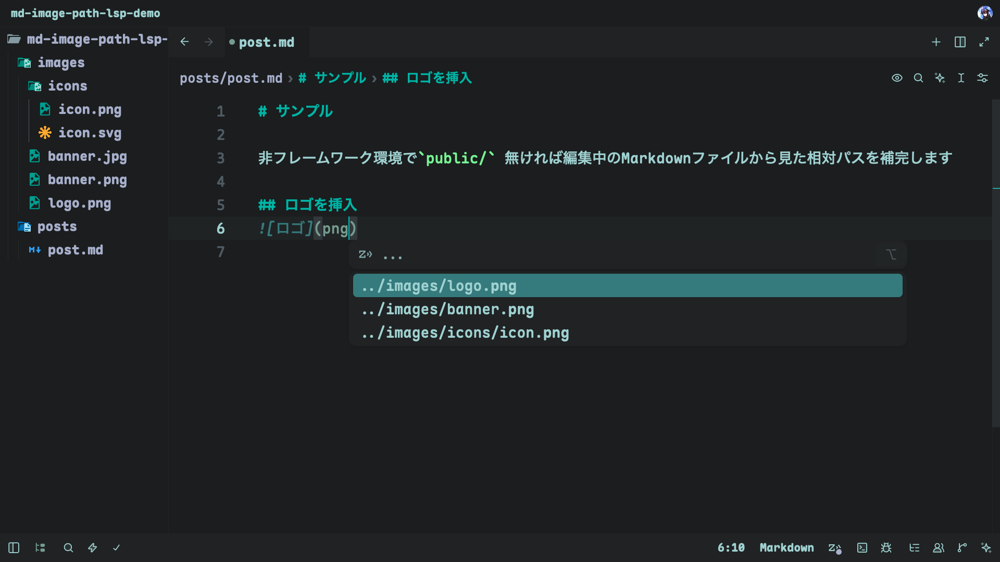

<div align="center">

# md-image-path-lsp

[English](./README.md)

**Markdown の画像パスを、ワークスペースの実ファイルに合わせて補完する Language Server**

[](https://www.npmjs.com/package/md-image-path-lsp)
[](./server/LICENSE)

</div>

---

Markdown の画像記法 `` の中で、ワークスペース内の画像ファイルへの相対パスを補完する Language Server と、それを使うための Zed 拡張機能です。

## 2種類のパス補完

Next.js や Vite のように `public/` 配下を静的配信するフレームワーク環境と、フレームワークを使わずただ Markdown を書く用途、どちらでも自然なパス補完を行います。

<table>
<tr>
<th align="left"><code>public/</code> があるフレームワーク環境(Next.js / Vite など)</th>
</tr>
<tr>
<td>

`public/` を Web ルートとみなし、`/images/logo.png` のような絶対風パスを補完します。



</td>
</tr>
<tr>
<th align="left"><code>public/</code> が無い、素の Markdown 編集環境</th>
</tr>
<tr>
<td>

編集中の Markdown ファイルから見た相対パス(`../images/logo.png` 等)を補完します。ブログ記事や README など、ファイルをそのまま(Obsidian や GitHub、静的ファイルビューアで)表示する用途に向いています。



</td>
</tr>
</table>

## 構成

```
.
├── server/          Language Server本体 (npm: md-image-path-lsp)
├── clients/zed/     Zed拡張機能 (server/ をnpm経由で自動取得するラッパー)
└── clients/vscode/  VS Code拡張機能 (server/ を依存パッケージとして同梱するラッパー)
```

エディタ非依存な `server/` はZed・VS Code以外でも `npx md-image-path-lsp --stdio` で任意のLSPクライアントから利用できます。詳細は各ディレクトリのREADMEを参照してください。

- [server/README.ja.md](./server/README.ja.md) — Language Server本体の使い方
- [clients/zed/README.ja.md](./clients/zed/README.ja.md) — Zed拡張機能のセットアップ
- [clients/vscode/README.ja.md](./clients/vscode/README.ja.md) — VS Code拡張機能のセットアップ

## 対応エディタ

| エディタ | 状況 |
|---|---|
| **Zed** | `clients/zed/` で対応済み |
| **Neovim / Helix / Emacs (eglot)** など | 汎用LSPクライアント設定から `npx md-image-path-lsp --stdio` を直接呼び出せば利用可能 |
| **VS Code** | [Marketplace](https://marketplace.visualstudio.com/items?itemName=yuzukq.md-image-path-lsp-vscode) で公開済み |

---

<div align="center">

Released under the [MIT License](./server/LICENSE)

</div>
